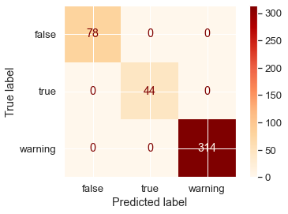

# 1) Cargamos los datos 📕

```python
data = pd.read_csv("data/ohe_customer_dataset.csv", sep=',') 
```

# 3) Clasificación 🎯

## 3.1) Separación de X de Y, y luego TR de TS (rutina):

- Su variable objetivo es `fraudulent`
- Consideren `test_size=0.3`

## 3.2) Creación del modelo predictivo

- Consideren `n_estimators=500` y `random_state=99`

## 3.4) Matriz de confusión

### a) Valores absolutos:

Deberían llegar a algo así:


### e) ¡Importante! Elección de un punto de corte

**Aclaración:** Justo todos los pasos que hacíamos de acá en adelante, están pensados para una clasificación binaria.
<br>Para este caso que es multiclase, no tiene sentido, **por eso no los hacemos.**

# 4) Guardar un modelo

Guardarlo con el nombre `modelo_proyecto_final.pkl`

# [OPCIONAL] MLFlow 🙌

Pueden incluir hacer tracking de 3 parámetros que deseen, 1 métrica y guardado del modelo con MLFlow.
