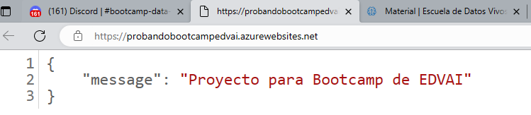

# Fastapi 😎

## Para la llamada a la API (call_api.py)
- Consideren esta data para el campo `data` del request
    ```python
    # CASO 1 -> Tipo de fraude: 0/False
    data = {
        "orderAmount" : 18.0,
        "orderState" : "pending",
        "paymentMethodRegistrationFailure" : "True",
        "paymentMethodType" : "card",
        "paymentMethodProvider" : "JCB 16 digit",
        "paymentMethodIssuer" : "Citizens First Banks",
        "transactionAmount" : 18,
        "transactionFailed" : "False",
        "emailDomain" : "com",
        "emailProvider" : "yahoo",
        "customerIPAddressSimplified" : "only_letters",
        "sameCity" : "yes"
    }
    ```


## Para la creación de la API (main.py)

- De la misma manera que cargan el modelo, carguen el nombre de las columnas.
<br>Coloquen estas líneas de código debajo del bloque de código que carga el modelo.
    ```python
    COLUMNS_PATH = "model/categories_ohe_without_fraudulent.pickle"
    with open(COLUMNS_PATH, 'rb') as handle:
        ohe_tr = pickle.load(handle)
    ```
- También carguen sus puntos de corte / bins:
    ```python
    BINS_ORDER = os.path.join(MAIN_FOLDER, "model/saved_bins_order.pickle")
    with open(BINS_ORDER, 'rb') as handle:
        new_saved_bins_order = pickle.load(handle)

    BINS_TRANSACTION = os.path.join(MAIN_FOLDER, "model/saved_bins_transaction.pickle")
    with open(BINS_TRANSACTION, 'rb') as handle:
        new_saved_bins_transaction = pickle.load(handle)
    ```

- Para el endpoint `/prediccion`, llamen a su función `predict_fraud_customer`

- Tienen que adaptar los datos de input respecto a los datos que recibe el modelo. Entonces tienen que agregarle / reformatear el nombre de las columnas y los puntos de corte.
    ```python
    # Crear dataframe
    single_instance = pd.DataFrame.from_dict(answer_dict)
    
    # Manejar puntos de corte o bins
    single_instance["orderAmount"] = single_instance["orderAmount"].astype(float)
    single_instance["orderAmount"] = pd.cut(single_instance['orderAmount'],
                                     bins=new_saved_bins_order, 
                                     include_lowest=True)
    
    single_instance["transactionAmount"] = single_instance["transactionAmount"].astype(int)
    single_instance["transactionAmount"] = pd.cut(single_instance['transactionAmount'],
                                     bins=new_saved_bins_order, 
                                     include_lowest=True)
    
    # One hot encoding
    single_instance_ohe = pd.get_dummies(single_instance).reindex(columns = ohe_tr).fillna(0)

    prediction = model.predict(single_instance_ohe)
    ```

- Como sabemos el model nos devuelve los tipos de fraude 1, 2 y 3 en el response.
    ```python
    # Cast numpy.int64 to just a int
    type_of_fraud = int(prediction[0])
        
    response = {"Tipo de fraude": type_of_fraud}
    ```

- Definir en uvicorn el puerto **7860** y host **0.0.0.0**

## Prueba de la API (call_api.py)

Ahora que saben que está funcionando su API. 
<br>Varien el campo `data` del request y evaluen que les trae como response.

```python
# CASO 2 -> Tipo de fraude: 1/True
data = {
    "orderAmount" : 26.0,
    "orderState" : "fulfilled",
    "paymentMethodRegistrationFailure" : "True",
    "paymentMethodType" : "bitcoin",
    "paymentMethodProvider" : "VISA 16 digit",
    "paymentMethodIssuer" : "Solace Banks",
    "transactionAmount" : 26,
    "transactionFailed" : "False",
    "emailDomain" : "com",
    "emailProvider" : "yahoo",
    "customerIPAddressSimplified" : "only_letters",
    "sameCity" : "no"
}
```
---

# Docker 🐳

- Armen el Dockerfile para su API.

- Para su Dockerfile consideren:
    - Usar la imagen `FROM python:3.9`
    - Puerto `7860` y host `0.0.0.0`

- Son libres de nombrar las carpetas, imagen y container como quieran. Les recomiendo que le coloquen un nombre representativo.

# [OPCIONAL] Microsoft Azure ✨

Pueden hacer el deploy de su Docker haciendo uso del método 1: Docker Hub + Web App o el método 2: Container Registry + Web App

Una vez deployado el proyecto, tomen una foto tipo:



**Una vez hecho eso, NO olviden eliminar los recursos de Azure**
