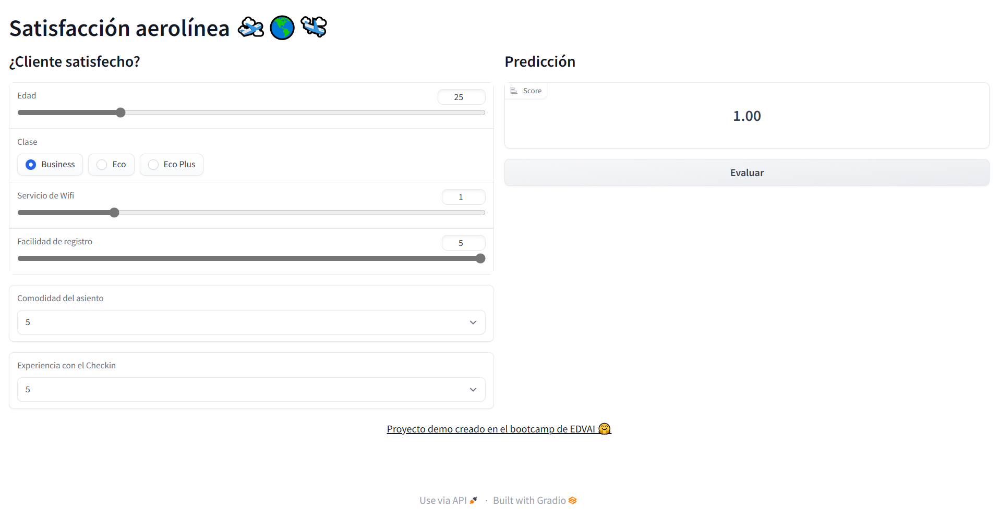

# Para el Entrenamiento (train)

## 0) Dataset 🛫🌎🛬

Nos basamos en el dataset de Kaggle: [Airline Passenger Satisfaction](https://www.kaggle.com/datasets/teejmahal20/airline-passenger-satisfaction).

## 1) Preparación de datos

- Hay que concatenar los 2 dataset de train y test:
    ```python
    data_train = pd.read_csv("train.csv", sep=',', index_col=0)
    data_test = pd.read_csv("test.csv", sep=',', index_col=0)
    all_data = pd.concat([data_train, data_test], axis=0)
    ```

- Este dataset tiene muchas columnas, así que solo nos vamos a quedar con algunas:
    ```python
    data = all_data[['Age', 'Class', 'Inflight wifi service', 'Ease of Online booking', 'Seat comfort', 'Checkin service', 'satisfaction']].copy()
    ```

- Cambiar el nombre de las columnas para evitar espacios en blanco y que sean más concisas.
    ```python
    data.rename(
        columns = {
            'Inflight wifi service': 'Wifi',
            'Ease of Online booking': 'Booking',
            'Seat comfort': 'Seat',
            'Checkin service': 'Checkin',
        }, 
        inplace=True
    )
    ```

- Cambiar los valores de la columna `satisfaction`:
    ```python
    class_map = {'neutral or dissatisfied': 0, 'satisfied': 1}
    data['satisfaction'] = data['satisfaction'].map(class_map)
    ```

- Hacer un get dummies.

## 2) Clasificación
- Su variable target o de interés a clasificar es `satisfaction`.

- Recuerden comentar y NO utilizar la siguiente celda:
    ```python
    data_x = data_x.values
    data_y = data_y.values
    ``` 

- Utilicen el 30% del dataset para test.

- Para el Random Forest consideren los parámetros `n_estimators=5000` y `random_state=19`

- **IMPORTANTE** El punto g) Análisis de los distintos puntos de corte, DEMORA MUCHO TIEMPO, aproximadamente > 2.000 min. **Así que si desean, lo pueden descartar.**

- Guarden el modelo con el nombre `rf.pkl`.
  **NOTA:** Este archivo es muy pero muy pesado (11,5 MB), así que tengan cuidado en caso de que quieran subir el modelo a un repositorio a Github. **Por eso en este ejercicio NO les pedimos cargar el modelo a un repositorio.**

- Guarden el nombre de las columnas
  ```python
    import pickle

    # Guardamos las columnas x (sin Satisfaction)
    with open('categories_ohe.pkl', 'wb') as handle:
        pickle.dump(data_x.columns, handle, protocol=pickle.HIGHEST_PROTOCOL)
  ```

# Para la creación de la interfaz (`app.py`)

- De la misma manera que cargan el modelo, carguen el nombre de las columnas.
<br>Coloquen estas líneas de código debajo del bloque de código que carga el modelo.
    ```python
    # Columnas
    COLUMNS_PATH = "model/categories_ohe.pkl"
    with open(COLUMNS_PATH, 'rb') as handle:
        ohe_tr = pickle.load(handle)
    ```

- Recuerden que su modelo tiene 5 columnas:
    ```python
    "Age",
    "Class",
    "Wifi",
    "Booking",
    "Seat",
    "Checkin",
    ```

- Tienen que adaptar los datos de input respecto a los datos que recibe el modelo. Entonces tienen que agregarle / reformatear el nombre de las columnas.
    ```python
    single_instance = pd.DataFrame.from_dict(answer_dict)
    
    # Reformat columns
    single_instance_ohe = pd.get_dummies(single_instance).reindex(columns = ohe_tr).fillna(0)
    
    prediction = model.predict(single_instance_ohe)
    ```

- Repliquen esta interfaz gráfica, y considere los valores de los componente que vos creas adecuado.
  
