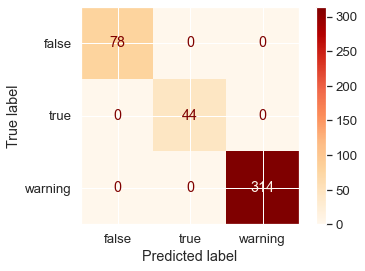

# Objetivo

Involucra Adaptación del dataset, Correlación, Preparación, Clustering y creación del modelo de clasificación.
 Items recomendados: MLFlow

# Output esperado

Tener un dataset filtrado y limpio en formato csv. Y un modelo que presente la siguiente Matriz de Confusión:

# Recomendaciones

Esta parte la dividimos en **5 items**: Adaptación, Correlación, Preparación, Clustering y Modelo.

Les recomendamos que se creen una carpeta llamada `data`, que contendrá el dataset el formato json. Y posteriormente el dataset el formato csv y los archivos .pickle.

El objetivo es que tengan la posibilidad de inspirarse en notebooks que hemos hecho a lo largo del bootcamp y hacer 5 notebooks con las soluciones.
 Acá les recomendamos nombres y estructura para que manejen cada notebook.

## 1) [Adaptación](Parte_A__p1.md)

Nombre recomendable para su notebook: **p1__Adaptación.ipynb**

Este notebook lo haremos desde cero, porque no se había trabajado con archivos JSON anteriormente.

## 2) [Correlación](Parte_A__p2.md)

Nombre recomendable para su notebook: **p2__Correlación.ipynb**

Se pueden inspirar del notebook que hicimos en la semana 2: Correlación.

## 3) [Preparación](Parte_A__p3.md)

Nombre recomendable para su notebook: **p3__Preparación.ipynb**

Se pueden inspirar del notebook que hicimos en la semana 3: Preparación.

## 4) [Clustering](Parte_A__p4.md)

Nombre recomendable para su notebook: **p4__Clustering.ipynb**

Se pueden inspirar del notebook que hicimos en la semana 5: Clustering.

## 5) [Modelo](Parte_A__p5.md)

Nombre recomendable para su notebook: **p5__Modelo.ipynb**

Se pueden inspirar del notebook que hicimos en la semana 4: Regresión.
